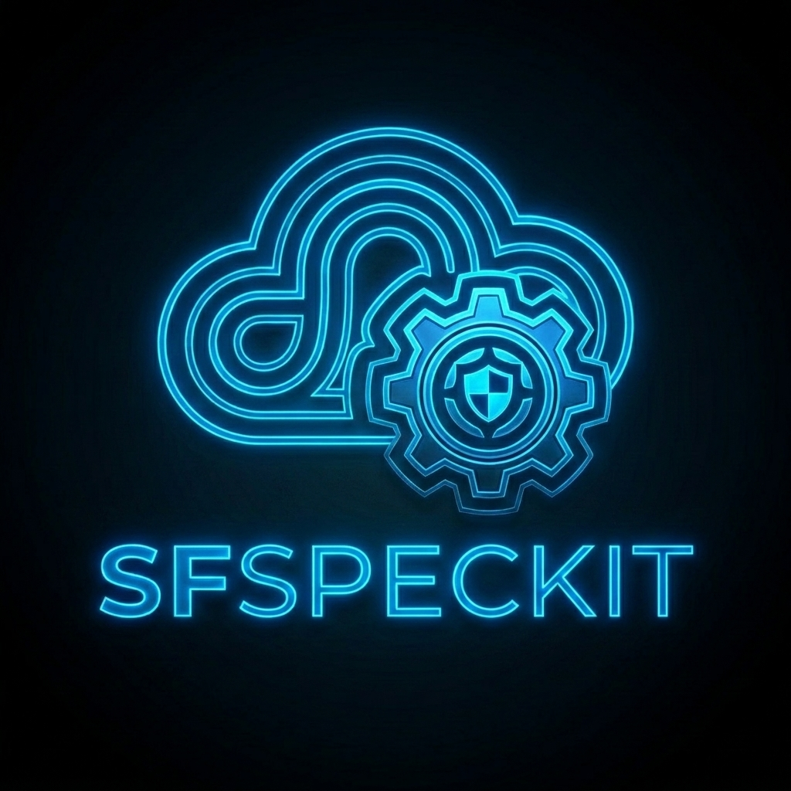
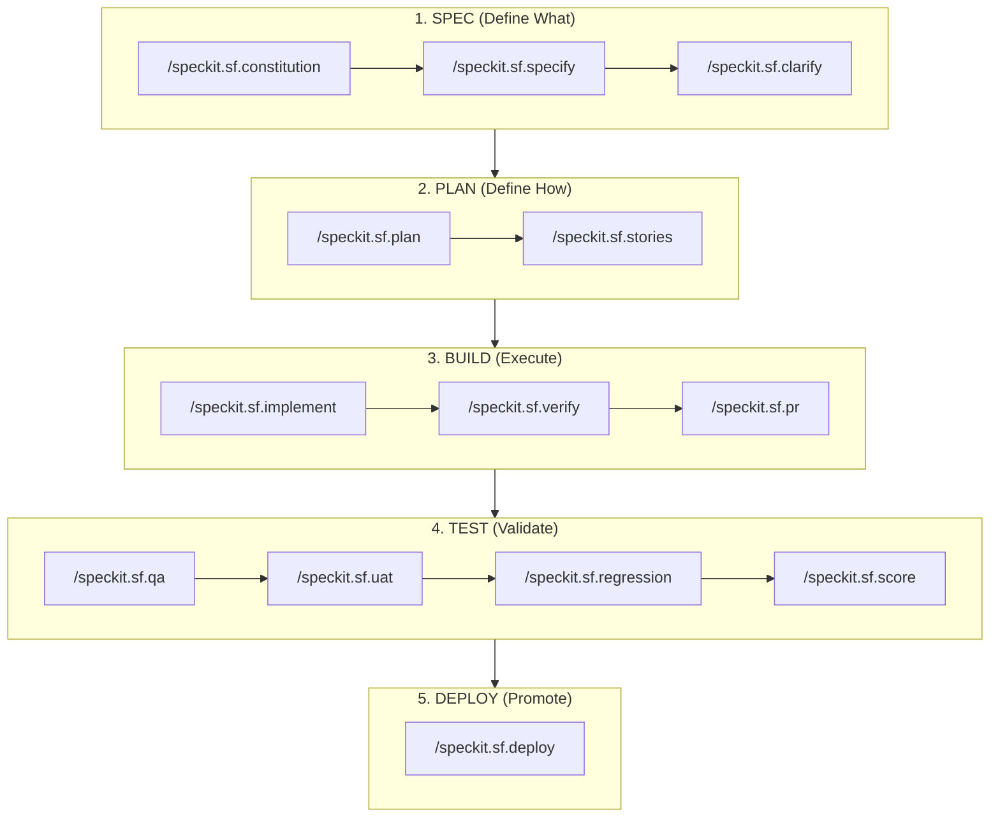

<div align="center">
  
  <h1>SFSpeckit — Salesforce Spec-Driven Development</h1>
  <p><b>Enterprise-Grade Spec-Driven Development (SDD) Framework for Salesforce: AI-Powered, Human-in-the-Loop Engineering.</b></p>

[](LICENSE)
[](https://github.com/github/spec-kit)
[](CHANGELOG.md)

</div>

<br/>

SFSpeckit transforms Salesforce delivery into an evidence-based, autonomous engine driven by structured specifications.

---

## 🏗️ Spec-Driven Development (SDD) for AI

SFSpeckit is built on the philosophy of **Spec-Driven Development (SDD)**. In the era of AI-agentic coding, jumping directly into implementation is the fastest way to hit context limits, create hallucinations, and accumulate technical debt.

### The SDD Strategy:

`Requirements (Spec) >>> Design (Plan) >>> Implementation (Build) >>> Test >>> Deploy`

> [!IMPORTANT]
> **Human-in-the-Loop (HITL) Engineering**: SFSpeckit is a Spec-Driven Development framework that enforces human validation and verification at every milestone. This ensures that the AI remains a grounded co-pilot, eliminating hallucinations and context drift through rigorous human sign-offs.

### The Tactical Lifecycle



1.  **SPEC (Define What)**: Functional requirements, user stories, and security matrices.
2.  **PLAN (Define How)**: Metadata strategy, class structures, deployment order, and blast radius analysis.
3.  **BUILD (Execute)**: Autonomous implementation with **Auto-Heal loops** and human verification.
4.  **TEST (Validate)**: Multi-persona QA, UAT sign-offs, and multi-org regression testing.
5.  **DEPLOY (Promote)**: Evidence-based promotion across complex environment landscapes.

### 🧠 Why SDD Framework for Salesforce?

- **🧠 Context Isolation**: By separating planning from building, the AI focuses on one logical layer at a time, drastically reducing hallucinations.
- **🛡️ Hallucination Guardrails**: Mandatory prerequisites and human-led scoring gates ensure the AI never proceeds on assumptions.
- **⚡ Zero Drift**: The extension architecture locks architectural best practices (Selector, Domain, Service), preventing logic "drift."
- **☁️ Salesforce-Native**: Built exclusively for the Salesforce Metadata API and enterprise design patterns.

---

## 🤖 Hybrid AI Architecture

SFSpeckit is "Self-Contained but Aware," optimized for portability and maximum intelligence:

- **Self-Contained**: Works perfectly as a standalone extension with Zero-Dependency. All architectural best practices are encoded into the instruction set.
- **Smart-Aware**: Automatically detects existing Salesforce foundational skills (`sf-apex`, `sf-lwc`, `sf-docs`) and uses them as **Optional Accelerators**.
- **Unified Rubric**: The **555-point quality scoring** in [`docs/scoring.md`](docs/scoring.md) is the absolute Source of Truth for the AI evaluator.

---

## 🛡️ The 9 Salesforce Constitution Articles

Every project is governed by a project "North Star" that enforces these 9 architectural principles:

| Article  | Principle         | What It Enforces                                            |
| :------- | :---------------- | :---------------------------------------------------------- |
| **I**    | Metadata-First    | Objects/Fields must be defined before logic references.     |
| **II**   | Bulk Awareness    | Mandatory 201+ record handling (bulkification).             |
| **III**  | Declarative-First | Flow over Apex decision mandate.                            |
| **IV**   | Absolute Security | Enforces `with sharing` and `WITH USER_MODE`.               |
| **V**    | PNB Test Pattern  | Positive, Negative, and Bulk test scenarios in every story. |
| **VI**   | Clean Layers      | Logic separation (Service, Selector, Domain layers).        |
| **VII**  | Deployment Safety | Mandatory dry-runs and environmental parity.                |
| **VIII** | Platform Context  | Prompt-ready architectural clarity.                         |
| **IX**   | Modular Logic     | Reusable, testable domain units.                            |

---

## 🤰 The Mother Story (Story 00)

Parallel development is often blocked by metadata dependencies. SFSpeckit solves this with **Story 00**:

- **Purpose**: A "Scaffold Build" that creates the functional shell (Fields, Objects, Apex headers).
- **Impact**: Once Story 00 is implemented, the entire team is unblocked to work on subsequent logic-heavy stories in parallel.

---

## 🛠️ Prerequisites & Dependencies

| Tool                 | Version | Required    | Purpose                                               |
| :------------------- | :------ | :---------- | :---------------------------------------------------- |
| **Spec Kit**         | ≥ 0.4.0 | ✅ Yes      | Core SDD framework engine.                            |
| **Salesforce CLI**   | ≥ 2.0.0 | ✅ Yes      | Metadata operations and org connectivity.             |
| **SF Code Analyzer** | ≥ 5.0.0 | ✅ Yes      | Static analysis (PMD 7) and data-flow analysis.       |
| **GitHub CLI**       | ≥ 2.0.0 | ⚠️ Optional | Automated Pull Request creation and reviews.          |
| **DX Project**       | —       | ✅ Yes      | Project must be an initialized Salesforce DX project. |

---

## 🚀 Installation & Setup

SFSpeckit is an officially accepted community extension for **[GitHub Spec Kit](https://github.com/github/spec-kit)**—the core engine for Spec-Driven Development, maintained by GitHub with over **87,000 stars**. 

> [!TIP]
> **Pioneering Status**: SFSpeckit is the **first-ever Salesforce-related extension** officially accepted into the Spec Kit Community Catalog.

### Step 1: Install Spec Kit CLI
You must have the core Spec Kit toolkit installed before adding SFSpeckit.

```bash
# Install Spec Kit via uv (Official Recommended Method)
uv tool install specify-cli --from git+https://github.com/github/spec-kit.git
```

### Step 2: Add SFSpeckit Extension
Once Spec Kit is installed, you can add SFSpeckit directly from the official catalog:

```bash
# Add SFSpeckit to your active project
specify extension add sf
```

*For local development or beta testing, you can also install via direct URL:*
```bash
specify extension add sf --from https://github.com/ysumanth06/spec-kit-sf/archive/refs/tags/v1.0.0.zip
```

### Step 3: Automated Environment Setup
After adding the extension, run the automated setup command. SFSpeckit will detect your OS and automatically configure your Salesforce environment, including the Salesforce CLI, GitHub CLI, and SF Code Analyzer:

```bash
/speckit.sf.setup
```

---

## 📋 Slash Commands

| Command                     | Who      | Purpose                                                          |
| :-------------------------- | :------- | :--------------------------------------------------------------- |
| `/speckit.sf.constitution`  | TPO      | **[DISCOVERY]** Establish project principles with org discovery. |
| `/speckit.sf.specify`       | TPO      | Create functional feature specs.                                 |
| `/speckit.sf.clarify`       | Arch     | **[DRIFT ALERT]** Deep gap analysis and drift audit.             |
| `/speckit.sf.plan`          | Arch     | Technical blueprint and deployment order.                        |
| `/speckit.sf.stories`       | Arch     | Break plan into Jira-ready developer stories.                    |
| `/speckit.sf.implement`     | Dev      | **[AUTO-HEAL]** Build story with auto-heal loop.                 |
| `/speckit.sf.review`        | TPO/Arch | TPO and Architect review of generated stories.                   |
| `/speckit.sf.verify`        | Dev      | Generate formal Verification Evidence documents.                 |
| `/speckit.sf.pr`            | Dev      | Prepare PR summary via `gh cli`.                                 |
| `/speckit.sf.qa`            | QA       | Multi-persona UI validation and persona coverage.                |
| `/speckit.sf.uat`           | BPO      | Business UAT scripts and sign-offs.                              |
| `/speckit.sf.score`         | QA/Arch  | 555-point real-time project health dashboard.                    |
| `/speckit.sf.deploy`        | Arch     | Multi-org environment promotion logic.                           |
| `/speckit.sf.change`        | TPO      | Impact analysis for mid-sprint requirement changes.              |
| `/speckit.sf.hotfix`        | Dev      | Emergency production patch workflow.                             |
| `/speckit.sf.regression`    | QA       | Full feature regression before release.                          |
| `/speckit.sf.release-notes` | TPO      | Business-ready delivery summary.                                 |

---

## 📁 Repository Structure

SFSpeckit organizes all SDD artifacts inside the `.specify` directory to maintain a clean project root.

```text
.specify/
├── memory/
│   └── constitution.md                 # Project "North Star"
├── specs/                              # Feature Specifications
│   └── 001-feature-name/
│       ├── spec.md                     # Functional Spec
│       ├── plan.md                     # Technical Plan
│       ├── verification-evidence.md    # Automated Evidence
│       └── stories/                    # Developer Work Units
│           ├── 00-shell.md             # Mother Story (Metadata & Skeletons)
│           └── 01-logic.md             # Implementation Story
├── extensions/
│   └── sf/                             # Extension Config
│       └── sf-config.yml
└── scripts/                            # Extension helper scripts
force-app/                              # Salesforce Metadata
sfdx-project.json                       # Core Salesforce Config
```

---

## 👨‍💻 Built by an Architect

SFSpeckit has been re-architected as a Spec-Kit extension by **Sumanth Yanamala**, a Salesforce Architect, to meet the unique challenges of the Salesforce development lifecycle.

Find more about the creator and his work on the **[SFSpeckit Documentation Site](https://ysumanth06.github.io/spec-kit-sf/)**.

---

## 🌟 Giving Back

This framework is my contribution to the incredible Salesforce community. Throughout my career, the community has been a constant source of support, learning, and inspiration. I am sharing **SFSpeckit** as a way to give back to the platform and the people that have shaped my professional journey.

---

## ❤️ Special Thanks

This project is the result of many months of work, often stretching into late nights and weekends. I want to extend my deepest gratitude to my wife, **Srija**, for her unwavering support, understanding, and patience throughout this journey. This project wouldn't have been possible without her.

---

## ⚖️ License

[MIT](LICENSE) — © 2026 Sumanth Yanamala
