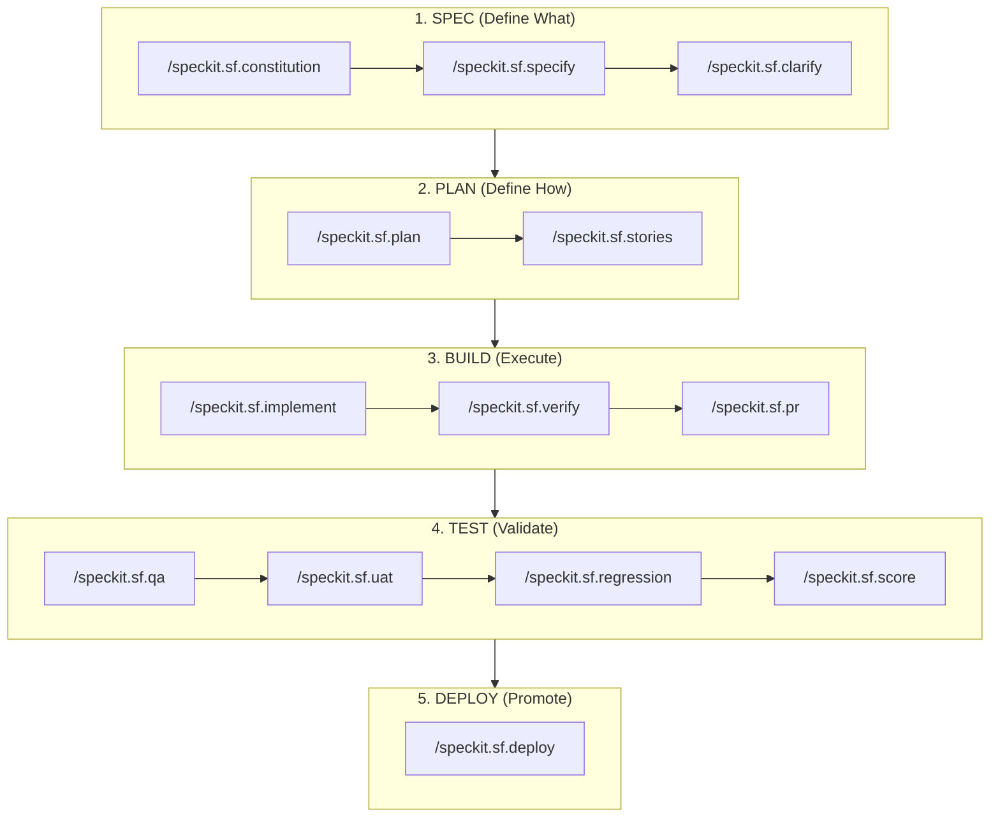

<div align="center">
  
  <h1>SFSpeckit — Salesforce Spec-Driven Development</h1>
  <p><b>Enterprise-Grade Spec-Driven Development (SDD) Framework for Salesforce: AI-Powered, Human-in-the-Loop Engineering.</b></p>

[](LICENSE)
[](https://github.com/github/spec-kit)
[](CHANGELOG.md)

</div>

<br/>

SFSpeckit transforms Salesforce development from ad-hoc coding into a spec-driven, quality-gated process. It follows a deterministic lifecycle designed to eliminate AI hallucinations and architectural drift.

---

## 🏗️ Spec-Driven Development (SDD) for AI

SFSpeckit is built on the philosophy that **Requirements (Spec) must precede Design (Plan), which must precede Implementation (Build).**

### The Tactical Lifecycle



1.  **SPEC (Define What)**: Functional requirements, user stories, and security matrices.
2.  **PLAN (Define How)**: Metadata strategy, class structures, deployment order, and blast radius analysis.
3.  **BUILD (Execute)**: Autonomous implementation with **Auto-Heal loops** and human verification.
4.  **TEST (Validate)**: Multi-persona QA, UAT sign-offs, and multi-org regression testing.
5.  **DEPLOY (Promote)**: Evidence-based promotion across Dev → QA → UAT → Prod.

---

## 🤖 Hybrid AI Architecture

SFSpeckit uses a highly portable and intelligent model for execution:

- **Self-Contained**: Works perfectly as a standalone extension with Zero-Dependency. All best practices are encoded in internal logic.
- **Smart-Aware**: Automatically checks for existing Salesforce foundational skills (`sf-apex`, `sf-lwc`, `sf-docs`) and uses them as **Optional Accelerators**.
- **Unified Rubric**: The **555-point quality scoring** in [`docs/scoring.md`](docs/scoring.md) is the absolute Source of Truth for the AI evaluator.

---

## 🛡️ The 9 Salesforce Constitution Articles

Every project is governed by a "North Star" document that enforces these 9 architectural principles on every AI decision:

| Article | Principle | What It Enforces |
| :--- | :--- | :--- |
| **I** | Metadata-First | Objects/Fields must be defined before code references. |
| **II** | Bulk Awareness | Mandatory 201+ record handling (bulkification). |
| **III** | Declarative-First | Flow over Apex decision mandate. |
| **IV** | Absolute Security | Enforces `with sharing` and `WITH USER_MODE`. |
| **V** | PNB Test Pattern | Positive, Negative, and Bulk test scenarios in every story. |
| **VI** | Clean Layers | Logic separation (Service, Selector, Domain layers). |
| **VII** | Deployment Safety| Mandatory dry-runs and environmental parity. |
| **VIII** | Platform Context | Prompt-ready architectural clarity. |
| **IX** | Modular Logic | Reusable, testable domain units. |

---

## 🤱 The Mother Story (Story 00)

Parallel development is often blocked by metadata dependencies. SFSpeckit solves this with **Story 00**:
- **Purpose**: A "Scaffold Build" that creates the functional shell (Fields, Objects, Apex headers).
- **Impact**: Once Story 00 is implemented, the entire team is unblocked to work on logic-heavy stories in parallel.

---

## 🏎️ SFSpeckit vs. Standard "Chat-and-Code"

| Feature | Standard "Chat-and-Code" | SFSpeckit Extension |
| :--- | :--- | :--- |
| **Success Rate** | ~60% (Hallucination Risk) | **>95% (Deterministic Architecture)** |
| **Hallucination Protection** | None (Pure AI Autonomy) | **HITL Verification & Gated Inputs** |
| **Technical Debt** | High (Inconsistent patterns) | **Zero (Architect-enforced Articles)** |
| **Logic Drift** | High (Instructions fade) | **None (Locked SDD Lifecycle)** |
| **Scalability** | Fails at 2+ complex features | **Enterprise-Grade Multi-Team Ready** |

---

## 🚀 Installation & Setup

### 1. Add Extension
```bash
specify extension add sf --from https://github.com/ysumanth06/spec-kit-sf/archive/refs/tags/v1.0.0.zip
```

### 2. Automated Setup
Once added, run the setup command to install all external dependencies (Salesforce CLI, GitHub CLI, and Code Analyzer) automatically:

```bash
/speckit.sf.setup
```

### 3. Verify
```bash
specify extension list
```

---

## 📋 Slash Commands

| Category | Command | Purpose |
| :--- | :--- | :--- |
| **Foundation** | `/speckit.sf.constitution` | Establish project principles with org discovery. |
| **Core SDD** | `/speckit.sf.specify` | Create a feature spec. |
| | `/speckit.sf.clarify` | Run gap analysis and business clarification. |
| | `/speckit.sf.plan` | Technical architecture and blast radius analysis. |
| | `/speckit.sf.stories` | Generate Jira-ready stories with effort estimates. |
| | `/speckit.sf.implement` | Build a story with auto-heal loop and scoring gates. |
| **Lifecycle** | `/speckit.sf.review` | TPO + Architect approval gate. |
| | `/speckit.sf.change` | Mid-sprint change management. |
| | `/speckit.sf.verify` | Generate formal Verification Evidence. |
| | `/speckit.sf.pr` | PR preparation with scoring and security scans. |
| | `/speckit.sf.qa` | QA verification and persona coverage. |
| | `/speckit.sf.uat` | Business sign-off management. |
| | `/speckit.sf.score` | 555-point quality dashboard aggregator. |
| | `/speckit.sf.deploy` | Multi-environment promotion. |
| | `/speckit.sf.hotfix` | Emergency production fix workflow. |
| | `/speckit.sf.regression` | Full regression testing. |
| | `/speckit.sf.release-notes`| Auto-generated release documentation. |

---

## 🛡️ Success Architecture

SFSpeckit is designed to be **completely self-contained**. All Salesforce best practices are encoded in the internal logic, and the extension automatically performs **Auto-Heal** loops (up to 3 retries) to fix code that fails scoring gates.

## ⚖️ License

[MIT](LICENSE) — © 2026 Sumanth Yanamala
