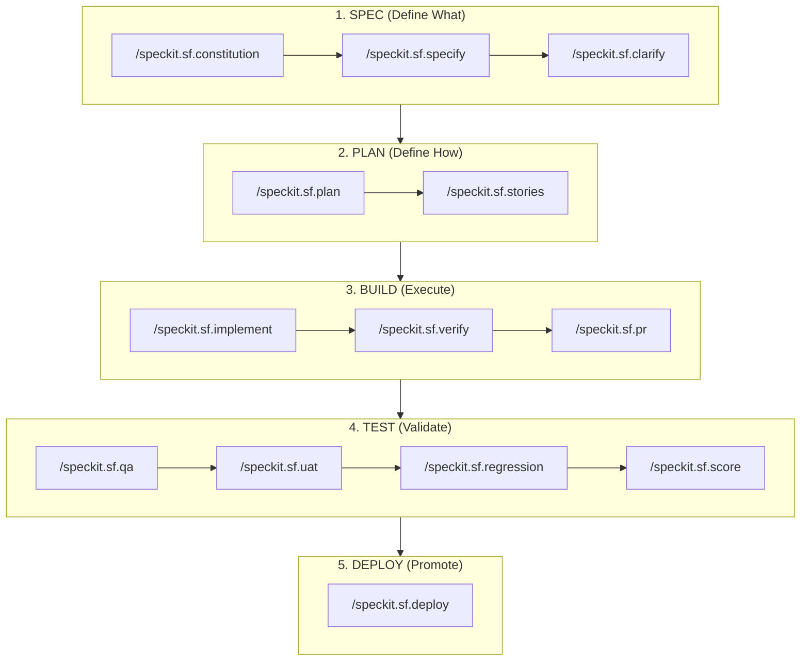

# SFSpeckit: Features & Methodology Deep-Dive

**Transforming Salesforce delivery into an evidence-based, autonomous engine driven by structured specifications.**

---

## 🏗️ Spec-Driven Development (SDD) for AI

SFSpeckit is built on the philosophy of **Spec-Driven Development (SDD)**. In the era of AI-agentic coding, jumping directly into implementation is the fastest way to hit context limits, create hallucinations, and accumulate technical debt.

### The SDD Strategy:

`Requirements (Spec) >>> Design (Plan) >>> Implementation (Build) >>> Test >>> Deploy`

> [!IMPORTANT]
> **Human-in-the-Loop (HITL) Engineering**: SFSpeckit is a Spec-Driven Development framework that enforces human validation and verification at every milestone. This ensures that the AI remains a grounded co-pilot, eliminating hallucinations and context drift through rigorous human sign-offs.



1.  **SPEC (Define What)**: Functional requirements, user stories, and security matrices.
2.  **PLAN (Define How)**: Metadata strategy, class structures, deployment order, and blast radius analysis.
3.  **BUILD (Execute)**: Autonomous implementation with auto-heal loops and human verification.
4.  **TEST (Validate)**: Multi-persona QA, UAT sign-offs, and multi-org regression scoring.
5.  **DEPLOY (Promote)**: Evidence-based promotion across complex environment landscapes.

### Why SDD Framework for Salesforce?

- **🧠 Context Isolation**: By separating planning from building, the AI focuses on one logical layer at a time, drastically reducing hallucinations.
- **🛡️ Hallucination Guardrails**: Mandatory prerequisites and human-led scoring gates ensure the AI never proceeds on assumptions.
- **⚡ Zero Drift**: The instructions in the extension lock the complex logic, preventing the AI from "drifting" away from architectural best practices.
- **☁️ Salesforce-Native**: Built exclusively for Salesforce, leveraging the Metadata API and enterprise-grade design patterns (Selector, Domain, Service).

---

## 📊 SFSpeckit vs. Standard "Chat-and-Code"

| Feature                      | Standard "Chat-and-Code"        | SFSpeckit Extension                     |
| :--------------------------- | :------------------------------ | :------------------------------------- |
| **Success Rate**             | ~60% (Hallucination Risk)       | **>95% (Deterministic Architecture)**  |
| **Hallucination Protection** | None (Pure AI Autonomy)         | **HITL Verification & Gated Inputs**   |
| **Technical Debt**           | High (Inconsistent patterns)    | **Zero (Architect-enforced Articles)** |
| **Logic Drift**              | High (Instructions fade)        | **None (Locked SDD Lifecycle)**        |
| **Scalability**              | Fails at 2+ complex features    | **Enterprise-Grade Multi-Team Ready**  |

---

## 🛡️ Evidence-Based Quality

Every build is measured against the Spec and the Constitution, providing a deterministic audit trail before any code is merged.

- **🔄 Auto-Heal**: If a build fails (linting, tests, or logic), the AI refers back to the Plan to self-correct up to 3 times, rather than guessing the intended logic.
- **Evidence Discovery**: `/speckit.sf.constitution` automatically scans your org for managed packages, integration endpoints, and metadata maturity to establish project principles tailored to your environment.
- **CLI-Driven Drift Detection**: `/speckit.sf.clarify` identifies manual org changes and multi-team conflicts before a plan is finalized.
- **Verification Evidence**: `/speckit.sf.verify` generates formal, audit-ready evidence (Coverage, Security, Performance) required for PR approval.

---

## 🤰 The Mother Story (Story 00)

Parallel development in Salesforce is often blocked by metadata dependencies (e.g., waiting for a new field or an Apex class head to exist). SFSpeckit solves this with the **Mother Story (Story 00)**.

- **Purpose**: A "Scaffold Build" that creates the functional shell of the feature.
- **Scope**: Metadata (Fields, Objects), Apex Class method headers (without logic), and LWC skeletons.
- **Impact**: Once Story 00 is implemented, the entire team is unblocked to work on subsequent logic-heavy stories in parallel.

---

## ⚡ Execution Log: The First 5 Minutes

Experience the autonomous discovery in action. SFSpeckit doesn't just ask questions; it scans your reality.

```text
$ /speckit.sf.constitution
> [!WARNING] Starting Environmental Discovery. Large orgs may take 1-2 minutes to scan.

[1/6] Scanning Installed Packages... DONE
      Detected: fflib Apex Common, Salesforce CPQ, Slack for Salesforce.
[2/6] Detecting Integration Endpoints... DONE
      Detected: 3 Named Credentials, 1 External Service (MuleSoft).
[3/6] Assessing Metadata Maturity... DONE
      Status: Active Flows (142) > Apex Classes (86).
      Posture: Flow-centric environment.
[4/6] Checking Org Limits... DONE
      AI Credits: 84% remaining.
[5/6] Syncing Constitution Articles... DONE
      Adjusting Article III: Strengthening Flow-first mandate based on org maturity.
      Adding Article X: Managed Package Coexistence (CPQ conflict prevention).
[6/6] Generating Document: .specify/memory/constitution.md... DONE

Constitution established. Ready for /speckit.sf.specify.
```

---

## 🛡️ The 9 Salesforce Constitution Articles

| Article | Principle         | What It Enforces                              |
| :---    | :---              | :---                                          |
| **I**   | Metadata-First    | Objects/Fields before logic.                  |
| **II**  | Bulk Awareness    | Mandatory 201+ record handling.               |
| **III** | Declarative-First | Flow over Apex decision mandate.              |
| **IV**  | Absolute Security | `with sharing` & `WITH USER_MODE`.            |
| **V**   | PNB Test Pattern  | Positive, Negative, Bulk test scenarios.      |
| **VI**  | Clean Layers      | Logic separation (Service, Selector, Domain). |
| **VII** | Deployment Safety | Mandatory dry-runs and syncs.                 |
| **VIII**| Platform Context  | Prompt-ready architectural clarity.           |
| **IX**  | Modular Logic     | Reusable, testable domain units.              |

---

## 📋 Slash Commands (Extended Lifecycle)

| Command | Who | Purpose |
| :--- | :--- | :--- |
| `/speckit.sf.constitution` | TPO | **[DISCOVERY]** Establish principles with org discovery. |
| `/speckit.sf.specify` | TPO | Create functional feature specs. |
| `/speckit.sf.clarify` | Arch | **[DRIFT ALERT]** Deep gap analysis and drift audit. |
| `/speckit.sf.plan` | Arch | Technical blueprint and deployment order. |
| `/speckit.sf.stories` | Arch | Break plan into Jira-ready developer stories. |
| `/speckit.sf.implement` | Dev | **[AUTO-HEAL]** Build story by orchestrating SF skills. |
| `/speckit.sf.verify` | Dev | Generate "Verification Evidence" (Coverage, Security, Perf). |
| `/speckit.sf.pr` | Dev | Prepares PR summary via `gh cli`. |
| `/speckit.sf.qa` | QA | Multi-persona UI validation. |
| `/speckit.sf.uat` | BPO | Business UAT scripts and sign-offs. |
| `/speckit.sf.regression` | QA | Full feature regression before release. |
| `/speckit.sf.release-notes` | TPO | Business-ready delivery summary. |
| `/speckit.sf.score` | QA | Real-time project health dashboard aggregator. |
| `/speckit.sf.change` | TPO | Impact analysis for mid-sprint changes. |
| `/speckit.sf.hotfix` | Dev | Emergency production patch workflow. |
| `/speckit.sf.deploy` | Arch | Multi-org environment promotion. |
| `/speckit.sf.setup` | Anyone| Automated dependency installer (SF CLI, Scanner, etc). |

---

## 👨‍💻 Built by an Architect

SFSpeckit has been re-architected from the ground up by **Sumanth Yanamala**, a Salesforce Architect, to meet the unique challenges of the Salesforce development lifecycle.

Find more about the creator and his work on his **[Personal Website](https://ysumanth06.github.io/LinkedIn-Personal-Website/)**.

The toolkit focuses on **metadata-driven development**, robust quality gates, and **autonomous Agentforce readiness**, ensuring that AI-assisted coding is as safe as it is fast.
