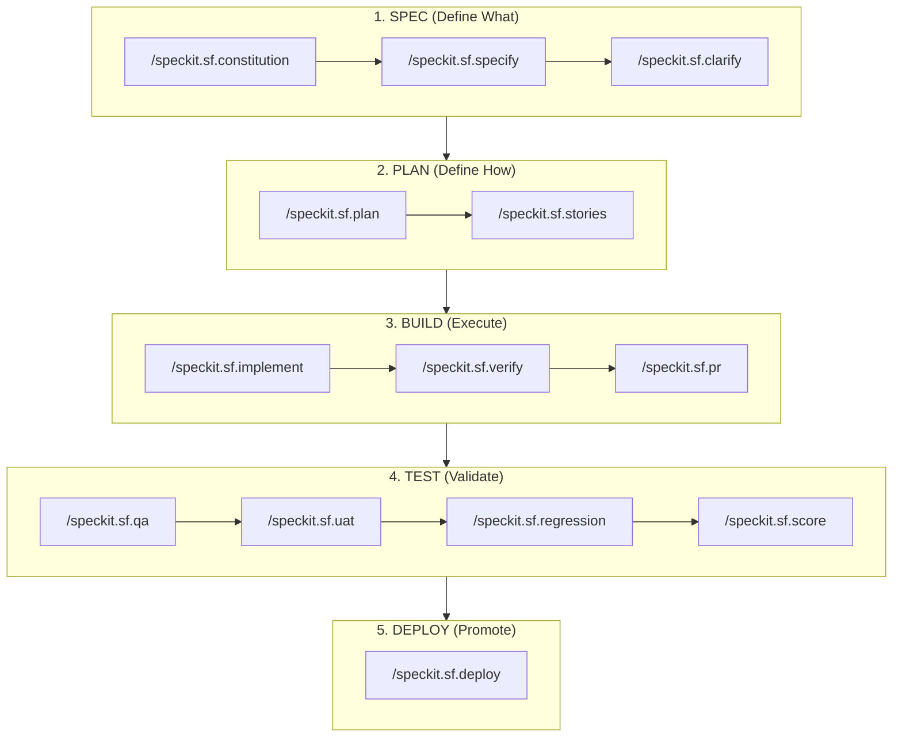

# SFSpeckit Features & Methodology

SFSpeckit transforms Salesforce development from ad-hoc coding into a **Spec-Driven Development (SDD)** lifecycle. In the era of AI-agentic coding, jumping directly into implementation is the fastest way to hit context limits, create hallucinations, and accumulate technical debt.

## 🏗️ Spec-Driven Development (SDD)

SFSpeckit is built on the philosophy that **Requirements (Spec) must precede Design (Plan), which must precede Implementation (Build).**

### The Lifecycle Map

1.  **SPEC (Define What)**: Functional requirements, user stories, and security matrices.
2.  **PLAN (Define How)**: Metadata strategy, class structures, deployment order, and blast radius analysis.
3.  **BUILD (Execute)**: Autonomous implementation with **Auto-Heal loops** and human verification.
4.  **TEST (Validate)**: Multi-persona QA, UAT sign-offs, and multi-org regression testing.
5.  **DEPLOY (Promote)**: Evidence-based promotion across Dev → QA → UAT → Prod.

---

## 🛡️ The 9 Salesforce Constitution Articles

Every project initialized with SFSpeckit is governed by a "North Star" document: the **Constitution**. This document enforces 9 architectural principles on every AI decision.

| Article | Principle | What It Enforces |
| :--- | :--- | :--- |
| **I** | Metadata-First | Objects/Fields must be defined before code references. |
| **II** | Bulk Awareness | Mandatory 201+ record handling (bulkification). |
| **III** | Declarative-First | Flow over Apex decision mandate. |
| **IV** | Absolute Security | Enforces `with sharing` and `WITH USER_MODE`. |
| **V** | PNB Test Pattern | Positive, Negative, and Bulk test scenarios in every story. |
| **VI** | Clean Layers | Logic separation (Service, Selector, Domain layers). |
| **VII** | Deployment Safety| Mandatory dry-runs and environmental parity. |
| **VIII** | Platform Context | Prompt-ready architectural clarity. |
| **IX** | Modular Logic | Reusable, testable domain units. |

---

## 🤰 The Mother Story (Story 00)

Parallel development in Salesforce is often blocked by metadata dependencies (e.g., waiting for a field or a class header to exist). SFSpeckit solves this with the **Mother Story (Story 00)**.

- **Purpose**: A "Scaffold Build" that creates the functional shell of the feature.
- **Scope**: Metadata (Fields, Objects), Apex Class method headers (without logic), and LWC skeletons.
- **Impact**: Once Story 00 is implemented, the entire team is unblocked to work on subsequent logic-heavy stories in parallel.

---

## 🏎️ SFSpeckit vs. Standard "Chat-and-Code"

| Feature | Standard "Chat-and-Code" | SFSpeckit Extension |
| :--- | :--- | :--- |
| **Success Rate** | ~60% (Hallucination Risk) | **>95% (Deterministic Architecture)** |
| **Hallucination Protection** | None (Pure AI Autonomy) | **HITL Verification & Gated Inputs** |
| **Technical Debt** | High (Inconsistent patterns) | **Zero (Architect-enforced Articles)** |
| **Logic Drift** | High (Instructions fade) | **None (Locked SDD Lifecycle)** |
| **Scalability** | Fails at 2+ complex features | **Enterprise-Grade Multi-Team Ready** |

---

## 🤖 Hybrid AI Intelligence

SFSpeckit uses a **Hybrid AI model** for execution:
- **Standalone Engine**: All best practices are encoded in `docs/scoring.md`, making the extension zero-dependency.
- **Tool Awareness**: If you have foundational Salesforce skills installed, SFSpeckit automatically detects them and uses them as **Optional Accelerators**.
- **Auto-Heal**: If a build fails linting or unit tests, the AI automatically refers back to the Plan and the Constitution to self-correct up to 3 times.
